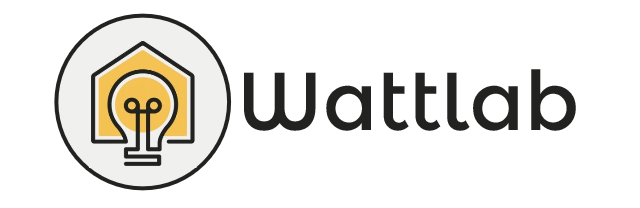

# WATTLAB 🚀👽
Aplicación web para el manejo de usuarios, activos, publicidad y consumo de energía en los hogares de Cali, Colombia 💥.


## Pre-requisitos 📋
* Tener instalado Node.js (12.16.3+), Python (3.7+), Django (3.0.3+) y PostgreSQL (10+).
* Tener instalado un entorno de desarrollo (IDE). En nuestro caso es utilizamos **Visual Studio Code**.
* Crear un entorno virtual en la carpeta donde vayas a descargar/clonar el repositorio del proyecto (puede ser en el escritorio). Para crear el entorno virtual debes abrir una consola o terminal y escribir lo siguiente:

**En Windows**
```
virtualenv myvenv
```
**En Linux**
```
virtualenv myvenv -p python3.7
```

## Instalación e inicialización 🔧
### Back-end ⚡
* Primero, se debe clonar el repositorio del proyecto en tu dispositivo local a través de la consola o terminal (te recomendamos que lo hagas dentro de la misma carpeta donde se creó el entorno virtual):
```
git clone http://github.com/sebastian18t/ProyWattlab
```
* Listo, ya tenemos el proyecto descargado/clonado.
* Abrimos el proyecto en nuestro entorno de desarrollo y regresamos a la vetana de comandos o terminal.
* Ahora, tenemos que activar el entorno virtual:

**En Windows**
```
cd myvenv
.\Scripts\activate
```
**En Linux**
```
cd myvenv/bin
source activate
```
* Nos dirigimos a la carpeta del proyecto desde el entorno virtual:

**En Windows**
```
cd ..
cd ProyWattlab
```
**En Linux**
```
cd .. (x2)
cd ProyWattlab
```
* Instalamos los requerimientos en la raíz de la carpeta:

**En Windows**
```
pip install -r requeriments.txt
```
**En Linux**
```
pip3 install -r requeriments.txt
```
* Realizamos las migraciones:

**En Windows**
```
python manage.py makemigrations
python manage.py migrate
```
**En Linux**
```
python3.7 manage.py makemigrations
python3.7 manage.py migrate
```
* Inicializamos el Back-end:

**En Windows**
```
python manage.py runserver
```
**En Linux**
```
python3.7 manage.py runserver
```
**Nota:** La ruta por defecto será: ```http://127.0.0.1:8000/```

### Front-end 🎨
* Navegamos hasta la carpeta que contiene todos los elementos de la interfaz gráfica (GUI):

**En Windows**
```
cd ProyWattlab\srcgui
```
**En Linux**
```
cd ProyWattlab/srcgui
```
* Instalamos las dependencias y módulos a través del gestor de paquetes de Node.js:
```
npm install
```
* Ejecutamos el proyecto desde el Front-end:
```
npm start
```
**Nota:** La ruta por defecto será: ```localhost:3000/```
* ¡Y listo! Tendremos nuestro proyecto funcionando tanto en el Back-end como en el Front-end.

## Desactivar la ejecución del proyecto

### Para desactivar el Back-end ⚡

* Ingresar a la consola o terminal donde se esté ejecutando este y presionar las siguientes teclas:
```
CTRL + C
```
* Desactivar el entorno virtual:
```
deactivate
```
* Cerrar la consola o terminal.

### Para desactivar el Front-end 🎨
* Ingresar a la consola o terminal donde se esté ejecutando este y presionar las siguientes teclas:
```
CTRL + C
```
**Nota:** Si pide confirmación para terminar de ejecutar la aplicación, escribir la letra ```y``` de *Yes*.
* Cerrar la consola o terminal.

## Este proyecto fue construido con 🛠️

* [Django](https://www.djangoproject.com/) - Framework utilizado para el Backend.
* [ReactJS](https://es.reactjs.org/) - Framework utilizado para el Frontend.
* [PostgreSQL](https://www.postgresql.org/) - Base de datos.
* [AWS (Amazon Web Services)](https://aws.amazon.com/es/) - Servicio de base de datos en la nube.
* [Heroku](https://www.heroku.com/) - Servicio de despligue de aplicaciones Web en la nube.
* [Trello](https://trello.com/b/WTm7WEHk/wattlab-the-scrum-board) - Tablero de desarrollo para la planeación y organización de las historias de usuario.

## Versionado 📌

* Versión 1.0.0

## Autores ✒️

* **Sebastián Tamayo Lasso** - *Scrum Master, Desarrollador Full-stack y QA Tester* - [sebastian18t](https://github.com/sebastian18t)
* **Fabián Andrés Benavides Labiano** - *Desarrollador Back-end y Analista de bases de datos* - [fabianunivalle](http://github.com/fabianunivalle)
* **María Paula Mosquera Rengifo** - *Desarrolladora Front-end* - [callmemapa](https://github.com/callmemapa)
* **Juan David Castro Cardona** - *Product Owner y Desarrollador Front-end* - [JuanCardona97](https://github.com/JuanCardona97)
* **Bryan Steven Biojó Romero** - *Desarrollador Front-end* - [bryansbr](http://github.com/bryansbr)
* **Daniel Stiven Cardona Cano** - *Desarrollador Front-end* - [Hickaro12](http://github.com/Hickaro12)

También puedes mirar la lista de todos los [contribuyentes](https://github.com/sebastian18t/ProyWattlab/graphs/contributors) quíenes han participado en este proyecto. 

## Notas finales 🎁

* No olvides comentar a otros sobre este proyecto 📢.
* Los programadores merecen una cerveza 🍺 para celebrar lo aprendido y desarrollado durante este proyecto. 
* Gracias a todos por hacer parte de esto 🤓.


---
⌨️ ¡Con ❤️ por nosotros, para ustedes! 😊
